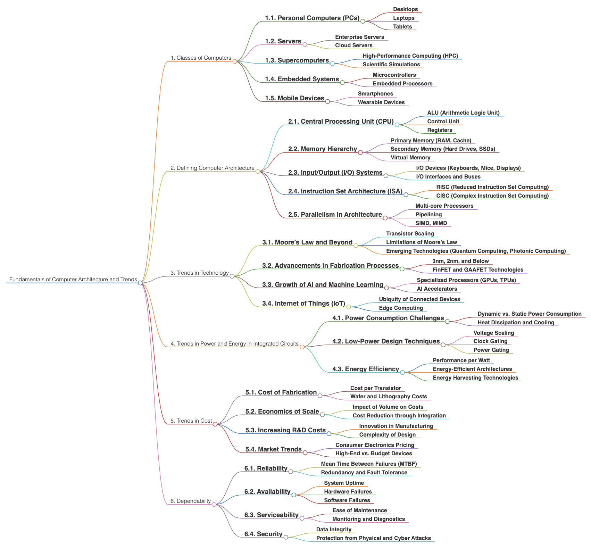
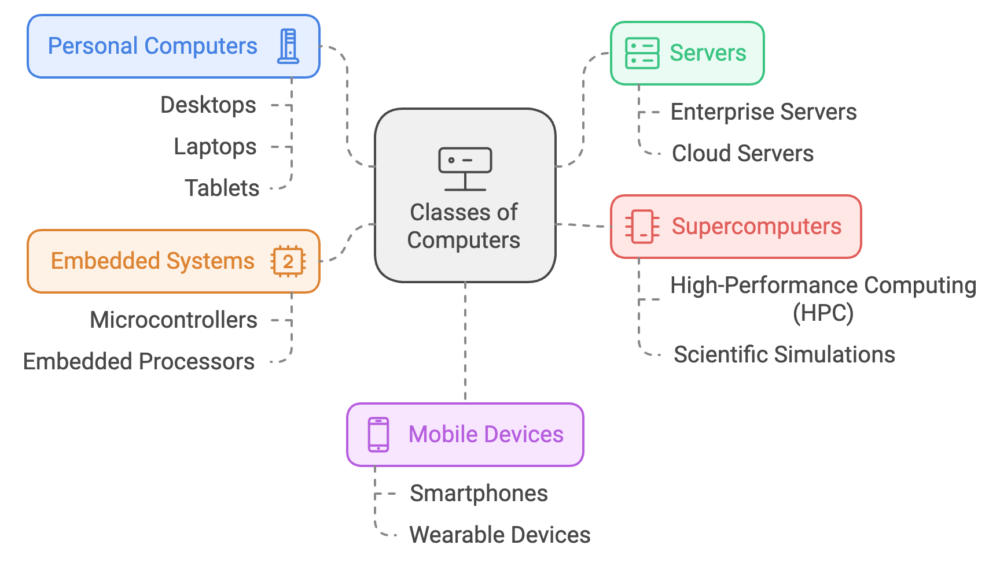
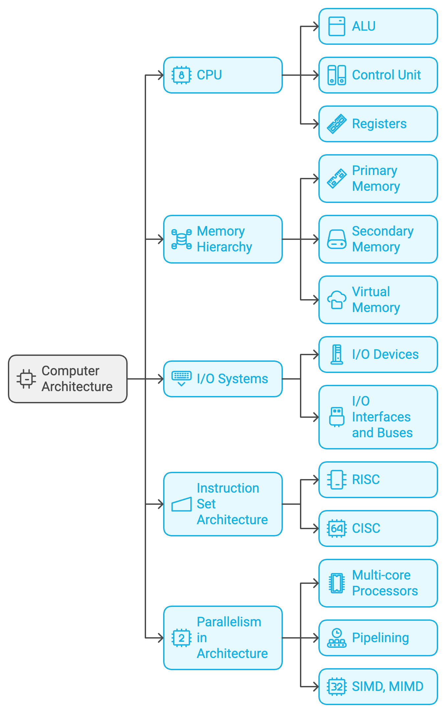
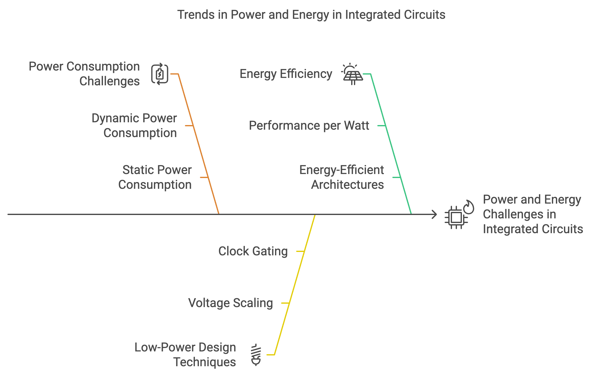
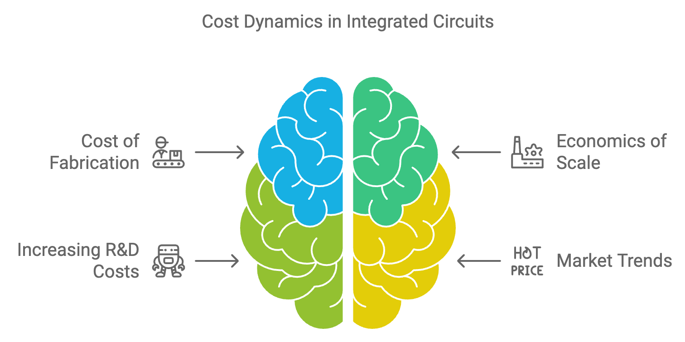
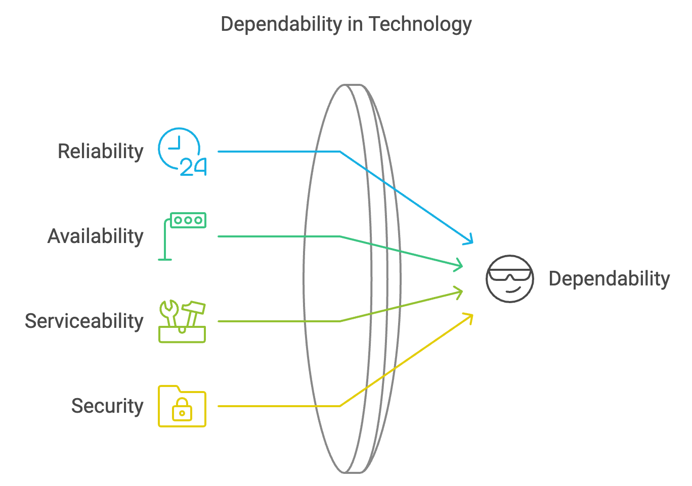

# Chapter 1: Fundamentals of Quantitative Design and Analysis

  

## Fundamentals of Computer Architecture and Trends

**Fundamentals of Computer Architecture and Trends** refers to the essential concepts and evolving patterns in the **design** and **organization** of **computer systems**. It involves an in-depth exploration of the various **classes of computers**, their **components** (such as **CPUs**, **memory hierarchies**, and **I/O systems**), as well as emerging **technologies** and **trends** that are shaping the future of computer architecture. This field studies how different architectural **elements** interact to optimize computational **efficiency** and **performance**, including addressing issues like **power consumption**, **cost**, and **dependability**. Understanding these fundamentals is crucial for grasping how modern computers are **built**, **operate**, and **advance** over time.

### 1. Classes of Computers

Computers are categorized into various classes, each designed to fulfill specific roles within computational ecosystems. Understanding these categories reveals the diverse applications of computational power, spanning from personal productivity to solving complex scientific challenges.

    

#### 1.1. Personal Computers (PCs)
- **Desktops**: Typically deployed in residential and office environments, desktops are general-purpose systems characterized by their modularity and expandability. These systems are highly customizable, with users able to upgrade components such as graphics cards, memory, and storage, making them well-suited for a wide spectrum of applications, from routine office tasks to intensive gaming and content creation workflows.
- **Laptops**: Portable computing systems that integrate processing power with mobility, addressing the requirements of both individual and professional users. Laptops come in various configurations, from lightweight ultrabooks for essential productivity tasks to high-performance gaming and workstation models that deliver substantial computational capabilities on the move.
- **Tablets**: Tablets are portable devices that serve as an intermediary between smartphones and laptops, optimized for casual browsing, media consumption, and lightweight productivity. Their touch-centric interfaces and array of applications make them versatile tools for educational purposes, entertainment, and basic computing needs.

#### 1.2. Servers
- **Enterprise Servers**: These are centralized computational resources that provide services to a network of computers and devices, managing substantial data volumes and facilitating multiple user requests. Enterprise servers are integral to business infrastructure, supporting applications, databases, and services critical for organizational operations, thereby ensuring scalability, reliability, and data integrity.
- **Cloud Servers**: Operating within virtualized environments, cloud servers offer scalable, on-demand computational resources accessible via the internet. They provide substantial flexibility and economic efficiency, enabling enterprises to adjust infrastructure dynamically without investing in physical hardware. Cloud servers are foundational to modern computing paradigms, supporting a range of services from web hosting to extensive data analytics.

#### 1.3. Supercomputers
- **High-Performance Computing (HPC)**: Supercomputers are designed for executing high-speed computations and are deployed in areas such as scientific research, climate modeling, and molecular dynamics. These systems are capable of processing immense datasets with extraordinary speed, allowing researchers to address computationally intensive problems that are infeasible for conventional systems.
- **Scientific Simulations**: Supercomputers are employed to simulate complex physical phenomena, from global climate patterns to subatomic particle interactions. Their ability to model these systems with high fidelity is essential for advancing our understanding of natural processes and phenomena that are difficult or impossible to observe directly.

#### 1.4. Embedded Systems
- **Microcontrollers**: These embedded computing units execute specific control functions within a broader system, such as in household appliances or automotive systems. Microcontrollers are designed for cost efficiency and minimal power consumption, providing just enough computational power and memory to execute dedicated tasks reliably.
- **Embedded Processors**: Integrated into specialized devices, embedded processors handle tasks that require real-time performance and reliability, such as in medical equipment or industrial automation. These processors are engineered to ensure continuous and dependable operation, which is vital in scenarios where failure is unacceptable.

#### 1.5. Mobile Devices
- **Smartphones**: Smartphones are highly versatile devices combining telecommunications, computing, and entertainment functionalities. These devices have become essential to contemporary life, offering extensive capabilities beyond basic communication, including high-resolution photography, GPS navigation, and access to myriad applications that support both personal and professional use.
- **Wearable Devices**: Devices like smartwatches and fitness trackers are designed for wearable use, providing health metrics, connectivity, and integration into broader smart ecosystems. Wearables are increasingly integral to the Internet of Things (IoT), enhancing user interaction with technology through health tracking, notifications, and smart device control, contributing to a more interconnected lifestyle.

### 2. Defining Computer Architecture

Computer architecture encompasses the foundational principles that dictate the design, organization, and functionality of computer systems. It involves a detailed consideration of various components such as the CPU, memory, and I/O subsystems, as well as how these elements interoperate to execute instructions efficiently and effectively.

    

#### 2.1. Central Processing Unit (CPU)
- **ALU (Arithmetic Logic Unit)**: The ALU is responsible for executing arithmetic operations (such as addition and multiplication) and logical operations (such as comparisons). It serves as the computational core of the CPU, performing the operations that drive computer functionality.
- **Control Unit**: The control unit orchestrates the execution of instructions by managing data flow between the CPU, memory, and peripheral devices. It ensures that instructions are fetched, decoded, and executed in the correct sequence, coordinating the various components of the computer system.
- **Registers**: Registers are small, fast storage units within the CPU that hold data and instructions temporarily during processing. These storage locations provide rapid access to critical information, minimizing latency by reducing the need to access slower main memory.

#### 2.2. Memory Hierarchy
- **Primary Memory (RAM, Cache)**: Primary memory includes Random Access Memory (RAM) and cache memory, both of which are essential for quick data access by the CPU. RAM holds data and instructions currently being processed, whereas cache provides even faster access to frequently used data, significantly boosting system performance.
- **Secondary Memory (Hard Drives, SSDs)**: Secondary memory provides persistent storage for programs, files, and data. Though slower than primary memory, secondary storage (including HDDs and SSDs) offers much larger capacities, ensuring data is retained even when the system is powered off.
- **Virtual Memory**: Virtual memory extends the effective capacity of primary memory by using portions of secondary storage to simulate additional RAM. This mechanism enables systems to handle larger workloads than what physical RAM alone could accommodate, thereby improving multitasking and application performance.

#### 2.3. Input/Output (I/O) Systems
- **I/O Devices (Keyboards, Mice, Displays)**: Input devices like keyboards and mice allow users to interact with the computer, while output devices such as displays provide feedback by visualizing results. These interfaces bridge the gap between the user and the computing system, enabling effective user interaction.
- **I/O Interfaces and Buses**: Interfaces and buses are critical for managing communication between the CPU, memory, and peripheral devices. Buses transport data, while interfaces ensure compatibility, facilitating the efficient transfer of information within the computer architecture.

#### 2.4. Instruction Set Architecture (ISA)
- **RISC (Reduced Instruction Set Computing)**: RISC architectures emphasize a simplified set of instructions, allowing for faster execution through optimized instruction pipelines. By focusing on a smaller set of more fundamental instructions, RISC architectures achieve high performance and energy efficiency, especially in embedded and mobile applications.
- **CISC (Complex Instruction Set Computing)**: CISC architectures incorporate a more comprehensive set of instructions, enabling more complex operations per instruction cycle. This approach reduces the workload on software by providing powerful instructions, which can simplify compiler design and reduce code size, albeit often at the cost of increased hardware complexity.

#### 2.5. Parallelism in Architecture
- **Multi-core Processors**: Modern CPUs often incorporate multiple cores, each capable of executing instructions concurrently. Multi-core processors significantly enhance parallelism, facilitating faster processing of multiple tasks or threads, which is particularly advantageous for applications requiring substantial computational resources.
- **Pipelining**: Pipelining is a method of overlapping the execution of multiple instructions by dividing them into distinct stages, such as fetching, decoding, and executing. This approach increases instruction throughput and improves overall CPU efficiency.
- **SIMD, MIMD**: Parallel data processing is further facilitated by SIMD (Single Instruction, Multiple Data), which performs the same operation on multiple data elements simultaneously, and MIMD (Multiple Instruction, Multiple Data), which allows independent operations on different data sets. These forms of parallelism are crucial for high-performance computing tasks, including vector processing and scientific simulations.

### 3. Trends in Technology

The evolution of computer architecture is profoundly shaped by emerging technological trends, including advancements in hardware, novel computational models, and changing paradigms in how computing resources are utilized.

    

#### 3.1. Moore’s Law and Beyond
- **Transistor Scaling**: Moore's Law has historically predicted the exponential growth of computational power through the doubling of transistor counts on integrated circuits every 18-24 months. This increase has driven significant advancements in performance and efficiency across computational devices.
- **Limitations of Moore’s Law**: As transistor sizes approach atomic scales, fundamental physical and economic barriers are being encountered. Issues such as quantum tunneling, increased leakage currents, and thermal dissipation challenges have limited further miniaturization, necessitating a shift to alternative technologies.
- **Emerging Technologies (Quantum Computing, Photonic Computing)**: Quantum computing leverages quantum mechanical phenomena to perform operations far beyond the capabilities of classical systems. Meanwhile, photonic computing utilizes light to transmit and process information, offering the potential for faster and more energy-efficient computations compared to electronic circuits.

#### 3.2. Advancements in Fabrication Processes
- **3nm, 2nm, and Below**: Recent fabrication advancements have pushed process nodes to the 3nm and 2nm levels, yielding more efficient chips with reduced power consumption and higher performance. These breakthroughs allow more transistors to be packed into a smaller area, contributing to energy-efficient high-performance computing.
- **FinFET and GAAFET Technologies**: Fin Field-Effect Transistor (FinFET) and Gate-All-Around FET (GAAFET) technologies represent innovative transistor designs that enhance control over channel conductivity, mitigating leakage currents and improving overall power efficiency. These advancements are crucial for continued performance gains in the face of scaling challenges.

#### 3.3. Growth of AI and Machine Learning
- **Specialized Processors (GPUs, TPUs)**: Graphics Processing Units (GPUs) and Tensor Processing Units (TPUs) are designed specifically to accelerate machine learning workloads. GPUs provide massive parallelism, ideal for training deep neural networks, while TPUs are specialized for inferencing tasks, significantly optimizing AI performance.
- **AI Accelerators**: AI accelerators are dedicated chips designed to enhance the efficiency of AI computations. These accelerators are increasingly integrated into devices ranging from edge sensors to data center servers, providing enhanced performance for real-time AI applications, such as image recognition, natural language processing, and autonomous systems.

#### 3.4. Internet of Things (IoT)
- **Ubiquity of Connected Devices**: The IoT represents a vast network of interconnected devices that communicate and share data over the internet, spanning smart homes, industrial automation, and urban infrastructure. The proliferation of IoT devices is reshaping how we interact with technology, enabling more intelligent and responsive environments.
- **Edge Computing**: Edge computing processes data closer to its source to minimize latency and reduce the burden on centralized data centers. This distributed approach is critical for applications requiring real-time analytics and low-latency responses, such as autonomous vehicles, healthcare monitoring, and industrial control systems.

### 4. Trends in Power and Energy in Integrated Circuits

Energy efficiency remains a pivotal concern in computer architecture, given the trade-off between performance gains and increased power consumption. Effective power management strategies are essential for sustainable computing, from personal devices to enterprise data centers.

    

#### 4.1. Power Consumption Challenges
- **Dynamic vs. Static Power Consumption**: Dynamic power is consumed when transistors switch states, whereas static power is due to leakage currents when transistors are in idle states. As transistor geometries shrink, static power has become an increasingly significant factor, necessitating new approaches to managing leakage and reducing overall energy use.
- **Heat Dissipation and Cooling**: The power consumption of modern processors results in considerable heat generation, which can degrade performance and component longevity. Advanced cooling solutions, including liquid cooling and phase-change materials, are employed to mitigate thermal issues and maintain system stability.

#### 4.2. Low-Power Design Techniques
- **Voltage Scaling**: Lowering the supply voltage is one of the most effective methods to reduce power consumption, as dynamic power scales quadratically with voltage. Voltage scaling is commonly used in mobile devices to extend battery life without significantly compromising performance.
- **Clock Gating**: Clock gating reduces dynamic power by disabling the clock signal to inactive parts of the circuit. By selectively stopping the clock in unused modules, significant power savings are achieved, especially in microcontrollers and SoCs.
- **Power Gating**: Power gating involves completely shutting off power to inactive sections of a chip to eliminate leakage currents. This technique is widely adopted in modern processors to manage static power consumption and enhance overall energy efficiency.

#### 4.3. Energy Efficiency
- **Performance per Watt**: The metric of performance per watt is increasingly used to evaluate computational efficiency, particularly in data centers where energy costs constitute a significant portion of operational expenses. Achieving higher performance per watt is essential for sustainable computing practices.
- **Energy-Efficient Architectures**: Architectural innovations aimed at energy efficiency focus on reducing unnecessary computations and optimizing data movement. Techniques such as near-threshold computing and specialized hardware accelerators are employed to minimize energy consumption while maintaining high performance.
- **Energy Harvesting Technologies**: Energy harvesting involves capturing ambient energy from sources like solar radiation, vibrations, or thermal gradients, converting it into usable power for computing devices. This is particularly relevant for IoT devices, where traditional power sources may be impractical.

### 5. Trends in Cost

Economic considerations are critical in the evolution and adoption of computing technologies. Factors such as fabrication complexity, economies of scale, and research and development investments all influence the cost dynamics of computer components.

    

#### 5.1. Cost of Fabrication
- **Cost per Transistor**: While the cost per transistor has historically decreased due to advancements in manufacturing processes, reaching smaller process nodes has increased fabrication costs. These rising costs are driven by the need for more advanced lithography, higher precision, and more complex design rules.
- **Wafer and Lithography Costs**: The cost associated with manufacturing wafers and employing cutting-edge lithography techniques, such as extreme ultraviolet (EUV) lithography, continues to rise. EUV technology is crucial for producing smaller transistors but requires substantial investment in equipment and process development.

#### 5.2. Economics of Scale
- **Impact of Volume on Costs**: High production volumes significantly reduce the per-unit cost of semiconductor devices, enabling more affordable technology for consumers. Economies of scale are especially important for consumer electronics, where market competition necessitates cost-effective production strategies.
- **Cost Reduction through Integration**: System-on-Chip (SoC) designs, which integrate multiple functions onto a single chip, reduce overall manufacturing costs and improve performance. By minimizing the need for separate components and enhancing data flow efficiency, integration lowers production costs and simplifies design.

#### 5.3. Increasing R&D Costs
- **Innovation in Manufacturing**: The cost of innovation in semiconductor manufacturing has increased due to the escalating complexity of fabrication technologies and the need for specialized equipment. Significant investment is required to maintain competitiveness and push the boundaries of process capabilities.
- **Complexity of Design**: The growing complexity of processor architectures, driven by demands for higher performance, energy efficiency, and reliability, necessitates considerable R&D investment. Advanced design processes, verification, and validation require sophisticated tools and expertise, contributing to increased costs.

#### 5.4. Market Trends
- **Consumer Electronics Pricing**: Consumer electronics pricing is influenced by several factors, including competition, technological advancements, and consumer demand for features. Market dynamics drive innovation while also exerting downward pressure on prices, resulting in better technology at lower costs for end-users.
- **High-End vs. Budget Devices**: The market differentiation between high-end and budget devices is influenced by varying consumer needs and price sensitivities. High-end devices incorporate the latest technologies and premium materials, while budget options focus on delivering essential functionalities at an accessible price point.

### 6. Dependability

Dependability is a critical attribute of computer architecture, encompassing reliability, availability, serviceability, and security. It ensures that systems operate consistently, withstand faults, and provide robust protection against security threats, which is vital for both consumer and mission-critical applications.

    

#### 6.1. Reliability
- **Mean Time Between Failures (MTBF)**: MTBF is a key metric for assessing system reliability, representing the average time between failures. High MTBF values indicate robust design and quality components, which contribute to the longevity and resilience of computing systems.
- **Redundancy and Fault Tolerance**: Redundancy involves incorporating duplicate components or systems to provide backup in case of failure. Fault-tolerant systems leverage redundancy to ensure uninterrupted operation, making them essential for critical environments where downtime is unacceptable.

#### 6.2. Availability
- **System Uptime**: Availability is measured by system uptime, reflecting the proportion of time that a system remains operational. High availability is crucial for services requiring continuous access, such as financial systems and cloud services, where outages can lead to significant financial and reputational losses.
- **Hardware Failures**: Hardware reliability is crucial for maintaining system availability. Rigorous quality assurance processes, error detection and correction mechanisms, and redundant design approaches help mitigate the impact of hardware failures on system uptime.
- **Software Failures**: Software robustness is achieved through comprehensive testing, debugging, and regular updates. Ensuring high software reliability is essential for preventing service interruptions due to bugs or unexpected errors.

#### 6.3. Serviceability
- **Ease of Maintenance**: Systems designed with serviceability in mind enable efficient diagnosis and repair, minimizing downtime. Features such as modular components, clear diagnostic tools, and remote management capabilities enhance ease of maintenance, which is particularly important in enterprise environments.
- **Monitoring and Diagnostics**: Continuous monitoring and diagnostics tools provide real-time insights into system performance, enabling proactive identification of potential issues. By detecting anomalies early, these tools help prevent failures and reduce unplanned outages, enhancing overall serviceability.

#### 6.4. Security
- **Data Integrity**: Ensuring data integrity involves protecting data from unauthorized modification or corruption. Mechanisms such as checksums, cryptographic hash functions, and redundancy are employed to verify that data remains unaltered, preserving its accuracy and trustworthiness.
- **Protection from Physical and Cyber Attacks**: Robust security measures are essential to safeguard computer systems against both physical and cyber threats. Physical security involves controlling physical access to hardware, while cybersecurity measures—such as firewalls, encryption, intrusion detection, and access controls—are deployed to protect systems from unauthorized access, malware, and cyberattacks.

## Contribution 🛠️
Please create an [Issue](https://github.com/drshahizan/project-management/issues) for any improvements, suggestions or errors in the content.

