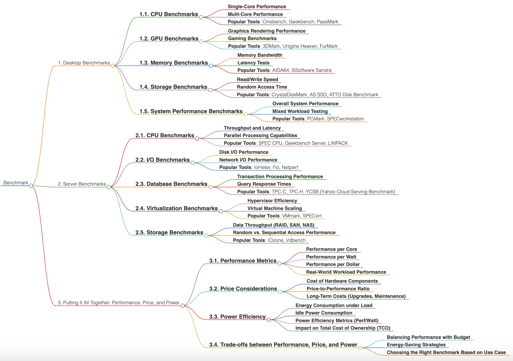
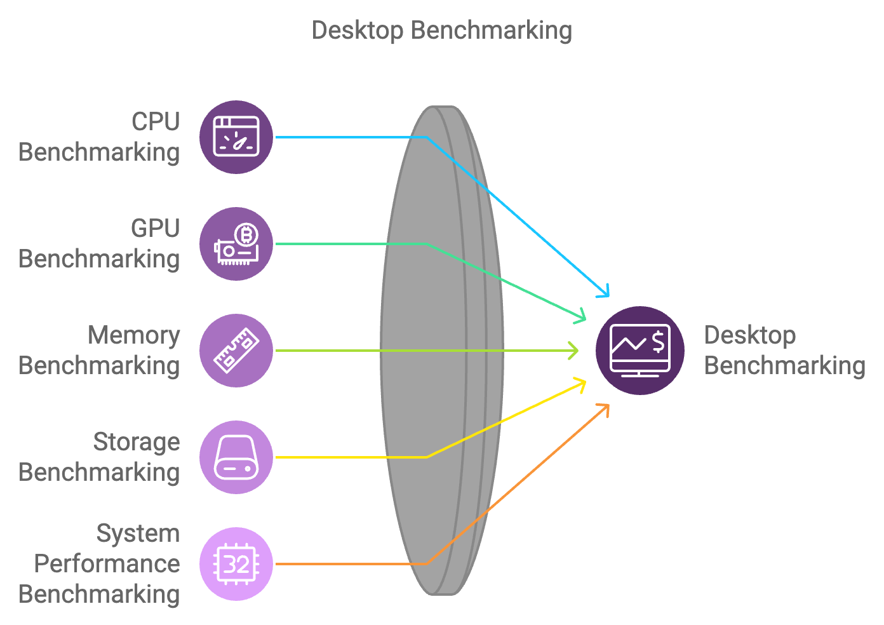
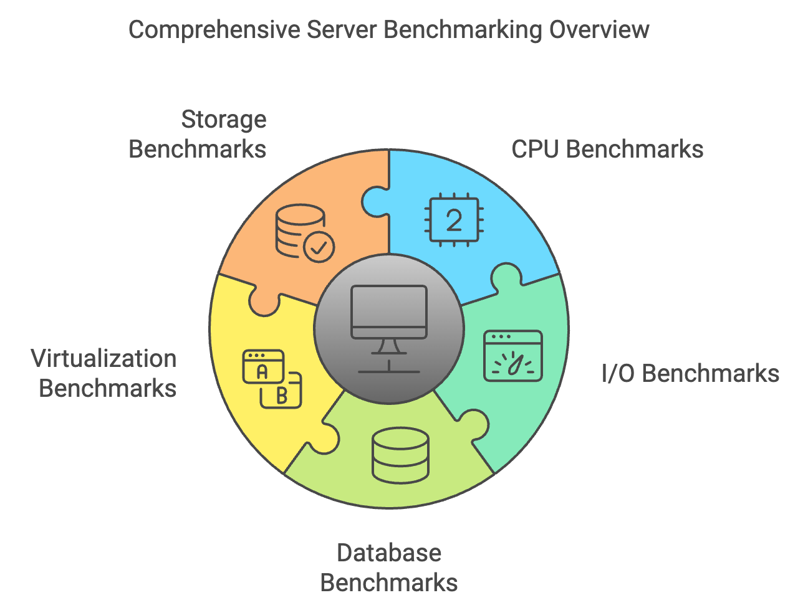

# Benchmark 

  

### Benchmark Overview

A benchmark is a rigorous, standardized methodology used to evaluate the performance of hardware or software components. Benchmarks provide objective, quantifiable metrics that facilitate the comparison of different systems or configurations, aiding in the selection of appropriate hardware for specific use cases. These tests are fundamental tools for both consumers and IT professionals, offering insights into the efficiency, capabilities, and constraints of technology. Benchmarks are applied across a wide spectrum of environments, including desktop and server systems, to assess elements such as CPU performance, graphics rendering capabilities, memory speed, storage throughput, and overall system efficiency. By providing a consistent framework for performance measurement, benchmarks enable informed purchasing decisions, system optimization, and validation that systems meet the performance demands of specific applications.

## 1. Desktop Benchmarks
Desktop benchmarks are designed to evaluate individual components such as CPUs, GPUs, memory, and storage, to assess their performance in conventional user environments. These benchmarks offer users insights into the expected performance of their systems for routine tasks, gaming, and content creation. Moreover, they provide crucial information regarding a system's ability to manage contemporary applications and multitasking scenarios, ensuring an optimal user experience for diverse workloads.

    

### 1.1. CPU Benchmarks
CPU benchmarks assess the computational power of a system's central processing unit. These evaluations encompass both single-core and multi-core performance, which are essential for understanding a system's capabilities across varied workloads.
- **Single-Core Performance**: Critical for applications that predominantly utilize a single thread, such as many gaming and productivity software. Single-core benchmarks provide insight into how effectively a CPU can handle tasks where the performance per core is more impactful than the number of available cores.
- **Multi-Core Performance**: Vital for tasks such as video rendering, parallel data processing, and running multiple concurrent applications. Multi-core benchmarks are particularly significant for content creators and professionals relying on software optimized for multi-threaded execution.
- **Popular Tools**: Cinebench, Geekbench, PassMark. These tools offer a comprehensive evaluation of CPU performance, applicable to both consumer-grade and enterprise-level scenarios.

### 1.2. GPU Benchmarks
GPU benchmarks evaluate the capabilities of the graphics processing unit, particularly in rendering graphics and managing intensive visual tasks. These benchmarks are widely used by gamers, as well as professionals in graphics-intensive fields such as video editing, 3D modeling, and animation.
- **Graphics Rendering Performance**: Measures the GPU's proficiency in rendering images, textures, and complex visual effects. This metric is essential for applications involving 3D modeling, visual effects, and high-definition video playback.
- **Gaming Benchmarks**: Focus on frame rates and visual fidelity during gameplay, offering a clear assessment of a GPU's suitability for current and future gaming titles. These benchmarks help determine whether a system can deliver the desired visual experience at various graphical settings.
- **Popular Tools**: 3DMark, Unigine Heaven, FurMark. These tools stress-test GPUs under various scenarios, from gaming to professional rendering, to evaluate both stability and peak performance.

### 1.3. Memory Benchmarks
Memory benchmarks measure the speed and efficiency with which data is transferred to and from the system's RAM, as well as its latency characteristics. Memory performance significantly affects system responsiveness, particularly in applications involving large data sets or real-time processing.
- **Memory Bandwidth**: Indicates the rate at which data can be transferred, which is critical for data-intensive tasks such as video editing and computational simulations.
- **Latency Tests**: Measure the delay between memory access requests, which impacts how quickly the CPU can retrieve data. Lower latency enhances the performance of real-time applications and ensures smooth operation in multitasking environments.
- **Popular Tools**: AIDA64, SiSoftware Sandra. These tools provide detailed analysis of memory bandwidth, latency, and efficiency, helping to identify potential bottlenecks in system performance.

### 1.4. Storage Benchmarks
Storage benchmarks evaluate the performance of storage devices, including hard drives and SSDs. These benchmarks are directly related to system boot times, application load times, and file transfer speeds.
- **Read/Write Speed**: Assesses how quickly data can be read from or written to storage. High read and write speeds are essential for rapid file access, system responsiveness, and the seamless loading of applications.
- **Random Access Time**: Evaluates the time required to access data at random locations, which is particularly important for daily computing tasks involving numerous small files.
- **Popular Tools**: CrystalDiskMark, AS SSD, ATTO Disk Benchmark. These tools provide a granular view of storage performance, assisting users in selecting storage solutions that align with their specific needs.

### 1.5. System Performance Benchmarks
System performance benchmarks provide a holistic evaluation of a desktop's performance across multiple workloads. They simulate real-world tasks to determine the effectiveness of the system as a cohesive unit.
- **Overall System Performance**: Assesses how well a system handles a broad spectrum of workloads, ranging from office productivity tasks to multimedia content creation. This helps determine the equilibrium among CPU, GPU, memory, and storage components.
- **Mixed Workload Testing**: Evaluates system performance under concurrent tasks such as video playback, gaming, and productivity software, offering insights into the system's multitasking capabilities.
- **Popular Tools**: PCMark, SPECworkstation. These tools deliver comprehensive assessments across a variety of real-world application scenarios, providing an aggregate view of system performance.

## 2. Server Benchmarks
Server benchmarks focus on evaluating the performance of server components under enterprise-level workloads, including data processing, virtualization, and database management. These benchmarks are essential for enterprises to ensure that their servers can support mission-critical applications reliably and efficiently.

    

### 2.1. CPU Benchmarks
Server CPU benchmarks assess the throughput and latency of processors, which are fundamental to the management of high-intensity applications and large volumes of concurrent data processing.
- **Throughput and Latency**: Measures the server's ability to process data efficiently under heavy loads, offering insights into how effectively it can manage multiple simultaneous requests.
- **Parallel Processing Capabilities**: Evaluates the efficiency of multi-threaded operations, crucial for workloads like data analytics, machine learning, and scientific computing.
- **Popular Tools**: SPEC CPU, Geekbench Server, LINPACK. These tools provide a robust evaluation of server CPU capabilities, determining whether the hardware is suitable for demanding enterprise environments.

### 2.2. I/O Benchmarks
I/O benchmarks determine the efficiency of a server in reading from and writing to storage, as well as its ability to manage network data transfer. This is critical for servers involved in database management, virtual machine hosting, or high-traffic web services.
- **Disk I/O Performance**: Evaluates the speed of data read/write operations, affecting how promptly data can be accessed or stored. High disk I/O performance minimizes data processing delays and enhances server responsiveness.
- **Network I/O Performance**: Assesses the speed and efficiency of data transfers across the network, which is critical for maintaining high performance in distributed computing and web services.
- **Popular Tools**: Iometer, Fio, Netperf. These tools help identify potential performance issues in data transfer and storage, providing insights into optimizing server configurations.

### 2.3. Database Benchmarks
Database benchmarks assess how effectively server systems handle database-related operations, which is crucial for applications that require extensive data manipulation and transaction processing.
- **Transaction Processing Performance**: Measures the number of transactions a database can process per second, which is vital for high-throughput environments such as e-commerce and financial services.
- **Query Response Times**: Evaluates the time required to execute database queries, directly impacting the performance of database-driven applications and user experience.
- **Popular Tools**: TPC-C, TPC-H, YCSB. These benchmarks offer standardized methods for evaluating the efficiency of database systems under various workloads, aiding in performance optimization.

### 2.4. Virtualization Benchmarks
Virtualization benchmarks evaluate the ability of a server to manage virtual machines efficiently, which is essential for maximizing resource utilization and scalability in a data center environment.
- **Hypervisor Efficiency**: Measures the overhead associated with hypervisors that manage virtual machines. Lower overhead translates to higher efficiency and better resource allocation.
- **Virtual Machine Scaling**: Determines how effectively a server can scale when hosting multiple virtual machines, an important factor for cloud infrastructure and virtualized environments.
- **Popular Tools**: VMmark, SPECvirt. These tools provide insights into the efficiency and scalability of hardware for supporting virtualized workloads, helping organizations maximize infrastructure utilization.

### 2.5. Storage Benchmarks
Server storage benchmarks evaluate how well storage systems perform when managing large volumes of data, which is critical for maintaining fast access and reliability in enterprise settings.
- **Data Throughput (RAID, SAN, NAS)**: Measures the efficiency of various storage architectures, such as RAID arrays, storage area networks (SAN), and network-attached storage (NAS). High throughput ensures that data access remains fast and reliable in multi-user environments.
- **Random vs. Sequential Access Performance**: Compares the performance of random and sequential read/write operations, relevant for different types of workloads, from transactional databases to media streaming.
- **Popular Tools**: IOzone, Vdbench. These tools offer detailed analysis of storage performance, assisting IT professionals in optimizing storage infrastructure for specific enterprise requirements.

## 3. Putting It All Together: Performance, Price, and Power
Benchmarking is not solely about achieving peak performance; it also involves finding an optimal balance between performance, cost, and power consumption. This triad is essential for making informed decisions that maximize efficiency and minimize total cost of ownership while reducing environmental impact.

    

### 3.1. Performance Metrics
Performance metrics help evaluate system efficiency, offering a framework for comparing various hardware configurations and understanding their suitability for specific applications.
- **Performance per Core**: Useful for assessing systems constrained by single-core performance. This metric is particularly relevant for applications that do not effectively utilize multiple cores.
- **Performance per Watt**: Indicates the energy efficiency of a system, which is crucial for reducing operational costs and minimizing heat generation. This metric holds significant importance in data centers, where power usage is a primary cost driver.
- **Performance per Dollar**: Measures the cost-effectiveness of a system, aiding users in determining which hardware configuration provides the best value for the investment. This metric is pivotal for balancing budget constraints against performance requirements.
- **Real-World Workload Performance**: Assesses how well systems handle realistic workloads, offering a more applicable measure of performance compared to synthetic benchmarks alone.

### 3.2. Price Considerations
Price considerations are integral to benchmarking, as the cost of components and long-term maintenance play a key role in the overall value of a system. Understanding price-performance ratios allows for better resource allocation.
- **Cost of Hardware Components**: Involves the initial purchase cost of CPUs, GPUs, memory, and storage. Assessing these costs helps in budgeting for upfront investment.
- **Price-to-Performance Ratio**: Evaluates the performance delivered for every dollar spent, aiding in the identification of components that provide optimal value. This is especially useful for IT departments with strict budgetary limits.
- **Long-Term Costs (Upgrades, Maintenance)**: Includes the total cost of ownership, accounting for potential upgrades, maintenance, and support over the lifecycle of the system. Planning for these costs ensures sustainability and continued relevance of the infrastructure.

### 3.3. Power Efficiency
Power efficiency is directly tied to operational expenses and sustainability goals, making it a crucial factor for individuals and enterprises alike.
- **Energy Consumption under Load**: Measures the power usage when the system is under heavy load, which helps determine the cost of running high-performance systems.
- **Idle Power Consumption**: Evaluates the energy usage when the system is idle. Minimizing idle consumption is vital for reducing the overall energy footprint, especially in environments where systems are not constantly under full load.
- **Power Efficiency Metrics (Perf/Watt)**: Quantifies the performance achieved per unit of power consumed, which is fundamental to optimizing both cost-efficiency and environmental sustainability.
- **Impact on Total Cost of Ownership (TCO)**: Energy efficiency directly influences cooling and power supply needs, which significantly impacts the total cost of ownership. Efficient systems can lead to considerable savings, particularly in large-scale deployments.

### 3.4. Trade-offs between Performance, Price, and Power
Understanding the interplay between performance, price, and power is critical to making informed hardware decisions. Each factor influences the others, and achieving an optimal balance is key to maximizing both performance and cost-effectiveness.
- **Balancing Performance with Budget**: Strives to maximize system value without exceeding budget constraints. This involves understanding the minimum performance requirements and selecting components that meet these needs effectively.
- **Energy-Saving Strategies**: Focuses on reducing operational costs through energy-efficient components and technologies. Utilizing energy-efficient CPUs and GPUs can lower overall consumption without substantially compromising performance.
- **Choosing the Right Benchmark Based on Use Case**: Different applications demand different benchmarks; recognizing these distinctions is crucial for selecting the right hardware. For example, a gaming-focused system prioritizes GPU benchmarks, whereas a data analysis server emphasizes CPU and memory benchmarks.

## Contribution 🛠️
Please create an [Issue](https://github.com/drshahizan/project-management/issues) for any improvements, suggestions or errors in the content.

