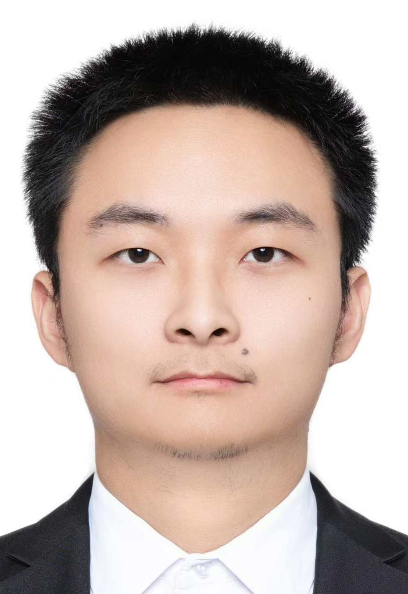

<!-- Add your profile image -->

  

<h1 align="center">Hi 👋, I'm Zheng Qixiao</h1>

---

## 🧑‍💻 About Me
- 🎓 **Master's Student in Computer Science**  
- 🧪 Researching **image processing, tensor decomposition, and convex optimization.**  

---

## 🎓 Education
- **Master of Science in Computer Science**  
  📍 _University Technology Malaysia, 2024 – Present_  

- **Bachelor of Engineering in Software Engineering**  
  📍 _Hainan University, 2017 - 2021_  

---

## 📂 Research Interests
- Image Processing & Computer Vision  
- Tensor Decomposition (CP, Tucker, etc.)  

---

## 🔧 Tools & Technologies
- **Programming Languages:** Python, C++, Java, MATLAB  
- **Machine Learning:** TensorFlow, PyTorch  

---

## 📫 How to Reach Me
- **Email:** [zhengqixiao@graduate.utm.my](zhengqixiao@graduate.utm.my)  
- **GitHub:** [Curry41](https://github.com/Curry41)

---

⭐️ _Feel free to explore my repositories and reach out if you’d like to collaborate!_

